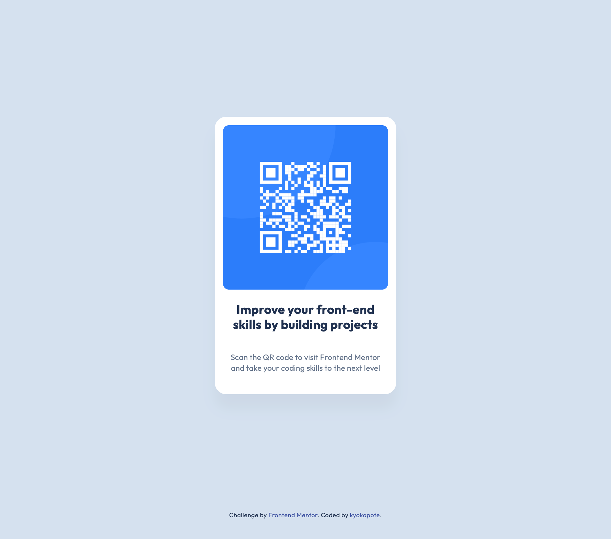

# Frontend Mentor - QR code component solution

This is a solution to the [QR code component challenge on Frontend Mentor](https://www.frontendmentor.io/challenges/qr-code-component-iux_sIO_H).  
Frontend Mentor challenges help you improve your coding skills by building realistic projects.

## Table of contents

- [Overview](#overview)
  - [Screenshot](#screenshot)
  - [Links](#links)
- [My process](#my-process)
  - [Built with](#built-with)
  - [What I learned](#what-i-learned)
- [Author](#author)

## Overview

### Screenshot

### Links

- Solution URL: [GitHub Repo](https://github.com/kyokopote-stack/qr-code-component)
- Live Site URL: _Not deployed yet_

## My process

### Built with

- Semantic HTML5 markup
- CSS
- Flexbox

### What I learned

I learned how to check spacing and padding in Figma more precisely.  
It helped me match the layout closer to the design.

## Author

- Frontend Mentor - [@kyokopote-stack](https://www.frontendmentor.io/profile/kyokopote-stack)
